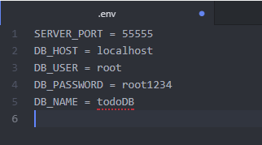

# Todo_API
Node.js todo api
# Project installation
## Database recovery
1. Open mysql and create a new database, name it as you like, example: todoDB
2. Open cmd and head to the bin directory of your mysql installment, example: C:\Program Files\MySQL\MySQL Server 5.7\bin
3. Once in bin directory run: mysql -h YOUR_HOST_ADDRESS -u YOUR_USERNAME -p YOUR_TARGET_DATABASE_NAME < PATH_TO_todoDB.sql
4. Type in your password and the database gets written.

## Configure Node
1. Go to the root directory of the project and run npm install.
2. Configure the .env-example file with the credentials of your own.
    * Set PORT to which port you want server to be ran on, example 55555.
    * HOST is the addres of your database host address, example: localhost.
    * USER field stands for the username of your database user, example: root.
    * PASSWORD is the password of your database users password, example: root1234.
    * Finally the DB field is the name of your database which you will be using, example: todoDB.
3. Rename .env-example to .env
4. Start the server with the command: node server.js

# Api calls and routes
All calls will return status code 400 on failure. POST, PUT and DELETE methods return status code 200 on success.

## /todo

### GET
    [
        {
            "id": 5,
            "what": "Bake cookies",
            "who": "Maija Meikäläinen",
            "in_progress": 1,
            "done": 0,
            "due": "2019-03-31T21:00:00.000Z",
            "priority": 1
        },
        {
            "id": 6,
            "what": "Buy groceries",
            "who": "Maija Meikäläinen",
            "in_progress": 1,
            "done": 0,
            "due": "2019-03-31T21:00:00.000Z",
            "priority": 5
        },
        {
            "id": 7,
            "what": "Go to sleep",
            "who": "Maija Meikäläinen",
            "in_progress": 0,
            "done": 0,
            "due": "2019-04-02T21:00:00.000Z",
            "priority": 1
        },
        {
            "id": 9,
            "what": "Do laundry",
            "who": "Maija Meikäläinen",
            "in_progress": 0,
            "done": 0,
            "due": "2019-04-01T21:00:00.000Z",
            "priority": 5
        },
        {
            "id": 10,
            "what": "Drink beer",
            "who": "Matti Meikäläinen",
            "in_progress": 0,
            "done": 1,
            "due": "2019-03-30T22:00:00.000Z",
            "priority": 5
        }
    ]

### POST

example:

    {
        "what": "Drink beer",
        "who": "Matti Meikäläinen",
        "in_progress": 0,
        "done": 1,
        "due": "2019-03-31",
        "priority": 5
    }

## /todo/:id

### GET
localhost:55555/todo/10
output: 

    [
        {
            "id": 10,
            "what": "Drink beer",
            "who": "Matti Meikäläinen",
            "in_progress": 0,
            "done": 1,
            "due": "2019-03-30T22:00:00.000Z",
            "priority": 5
        }
    ]

### PUT
In put method user can insert just the data that needs to be changed, inserting the whole object isn't necessary
example:

    {
        "what": "Change title",
        "who": "Developer",
        "in_progress": 1,
        "done": 0,
        "priority": 5
    }

### DELETE
Deletes by id.

## /priorities
### GET
    [
        {
            "id": 1,
            "title": "very low"
        },
        {
            "id": 2,
            "title": "low"
        },
        {
            "id": 3,
            "title": "medium"
        },
        {
            "id": 4,
            "title": "high"
        },
        {
            "id": 5,
            "title": "very high"
        }
    ]

## /priorities/:id
### GET
localhost:55555/priorities/1

    [
        {
            "id": 1,
            "title": "very low"
        }
    ]
